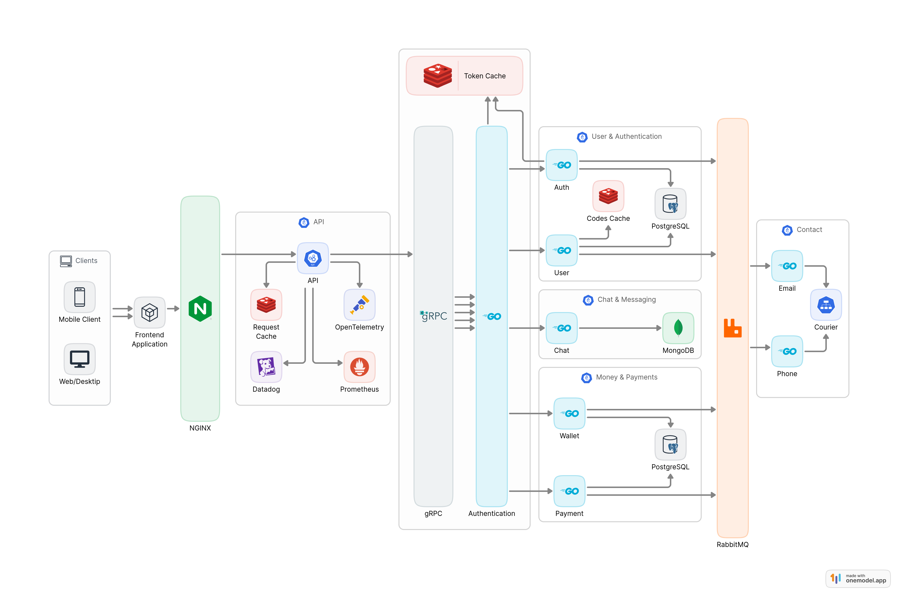

# fingo 🏦💸

[](https://goreportcard.com/report/github.com/escalopa/fingo)
[](https://wakatime.com/badge/user/965e81db-2a88-4564-b236-537c4a901130/project/429a1182-b0c0-4de2-9ef9-67246e1b4d21)
[](https://codecov.io/github/escalopa/fingo)
[](https://travis-ci.com/escalopa/fingo)

[](https://github.com/escalopa/fingo/issues)
[](https://github.com/escalopa/fingo/pulls)
[](https://opensource.org/licenses/MIT)

fingo is a scalable, robust payment system that allows users to send money to each other. fingo users can issue wallet with more than one currency.

Currently, fingo supports 5 currencies: USD, EUR, GBP, EGP, RUB.

Besides that we also support chat feature between its users to communicate with each other.

## Table of Contents 📑

  - [Tech Stack](#tech-stack) 🛠
  - [Project Architecture 🏘](#project-architecture-)
  - [How to run 🏃‍♂️](#how-to-run-)

## Tech Stack 🛠

fingo is built using scalable, reliable, robust and secure technologies which are listed below. 🔥

- Language: [Go](https://golang.org/)
- Communication: [gRPC](https://grpc.io/), [gin](https://github.com/gin-gonic/gin), [RabbitMQ](https://www.rabbitmq.com/)
- Database: [PostgreSQL](https://www.postgresql.org/), [Redis](https://redis.io/), [mongoDB](https://www.mongodb.com/)
- Deployment: [Docker](https://www.docker.com/), [Docker Compose](https://docs.docker.com/compose/), [Docker Swarm](https://docs.docker.com/engine/swarm/)
- Monitoring: [OpenTelemetry](https://opentelemetry.io/), [Datadog](https://www.datadoghq.com/), [Prometheus](https://prometheus.io/)
- Security: [Paseto](https://paseto.io/), [SSL/TLS](https://en.wikipedia.org/wiki/Transport_Layer_Security)
- External API: [Courier](https://www.courier.com/)


## Architecture 🏗

Communication between all the microservices is done using `grpc` or `message brokers` to
ensure that the system is scalable and reliable.

In fingo we have the following services, Where each one is responsible for a specific set of tasks,
Click on each service to see its documentation and how it works.

1. [**API**](./api) ==> Exposing the fingo API
2. [**Auth**](./auth) ==> Signing up, Signing in, Signing out
3. [**Token**](./token) ==> Validating access tokens
4. [**User**](./user) ==> Managing users data changes
5. [**Wallet**](./wallet) ==> Managing wallets CRUD with different currencies
6. [**Payment**](./payment) ==> Managing payments between users
7. [**Contact**](./contact) ==> Sending emails & SMS


Each service is built using the [Hexagonal Architecture](https://en.wikipedia.org/wiki/Hexagonal_architecture_(software)) pattern.
This allows us to have a clean separation between the business logic and the infrastructure. This way we can easily swap the infrastructure without affecting the business logic.

### Components


## How to run ⚙️

### Prerequisites

1. [Git](https://git-scm.com/book/en/v2/Getting-Started-Installing-Git)
2. [Docker](https://docs.docker.com/get-docker/)
3. [Docker Compose](https://docs.docker.com/compose/install/)

### Running the project

First clone the project

```bash
git clone github.com/escalopa/fingo && cd fingo
```

Copy

- `.env.example` file to `.env` and fill in the empty fields.
- `.db.env.example` file to `.db.env` and fill in the empty fields.

```bash
cp .env.example .env
cp .db.env.example .db.env
```

Run the project

```bash
docker-compose up
```
