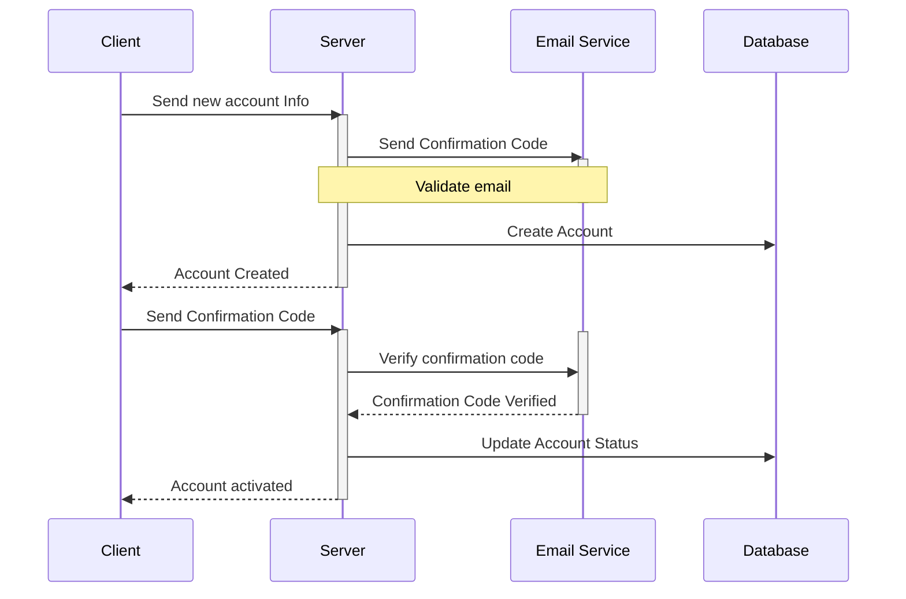
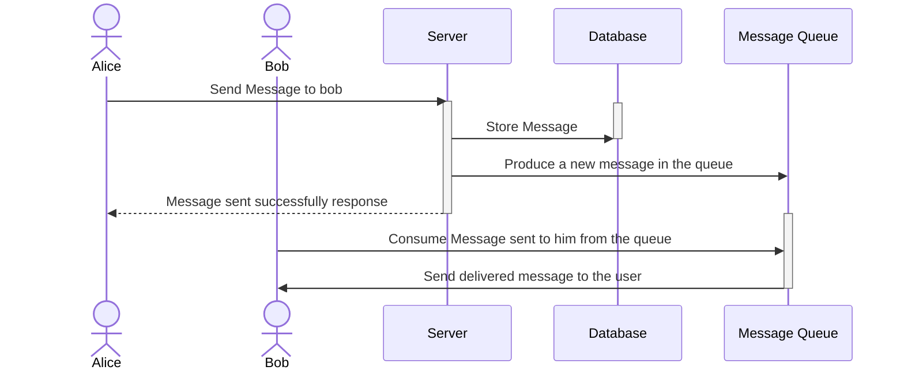
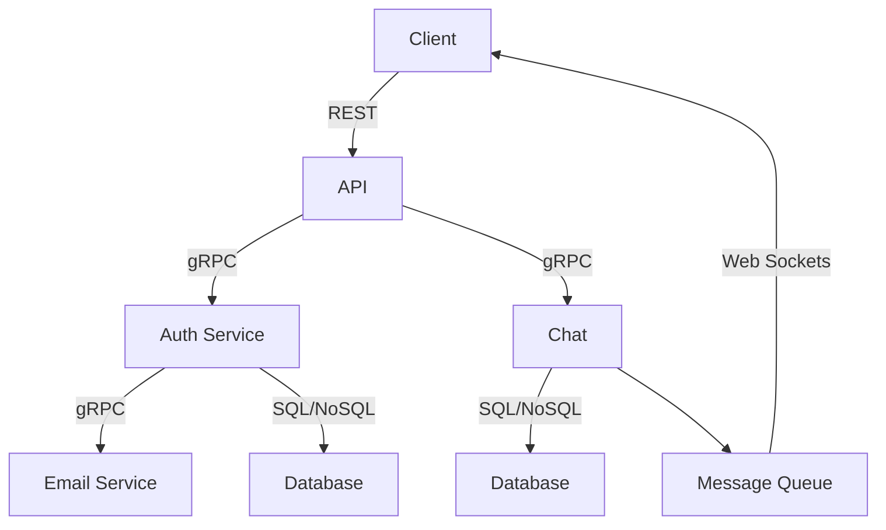

# gochat 💬

Live chatting distributed system service built with go, websockets, gRPC

## Functionalities & Features 🚀

- Chat with other users as in default messenger apps
- Chats are updated in real time as someone send a message
- Robust authentication with email verification
- Api endpoints to frontend consumption

## Micro-Services Architecture 🏗

Communication between all the microservices is done using `grpc`

The following services are responsible for

- **Chat**: Storing message between users
- **Email**: Sending and email for verifications
- **Auth** CRUD account and token handling
- **API** Providing endpoints to interact with the application

## How to run 🏃‍♂️

## Diagrams & BP 📝

* **Create An Account**
  - User creates a new account with email & password
  - Account confirmation is required to use the application, So a code is sent to your email upon creation.

* **Send Messages**
  - User must be authenticated to send messages
  - Messages are should be updated in real time using websockets

## Components Diagram 📊

