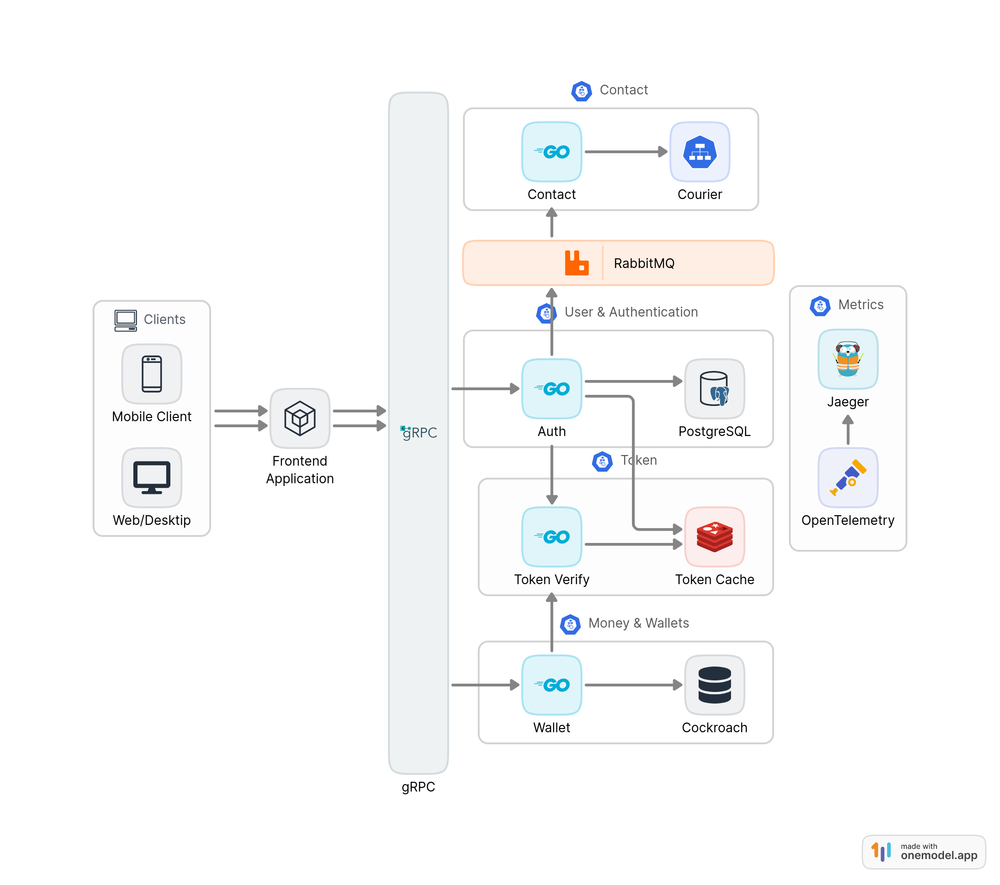

# fingo 🏦💸


[](https://goreportcard.com/report/github.com/escalopa/fingo)
[](https://wakatime.com/badge/user/965e81db-2a88-4564-b236-537c4a901130/project/429a1182-b0c0-4de2-9ef9-67246e1b4d21)

<!-- [](https://codecov.io/github/escalopa/fingo) -->

[](https://github.com/escalopa/fingo/issues)
[](https://github.com/escalopa/fingo/pulls)
[](https://opensource.org/licenses/MIT)

[](https://www.postman.com/lively-sunset-417832/workspace/public/collection/64306c0fe41234ba40c9dcec)

fingo is a scalable, robust payment system that allows users to send money to each other. fingo users can issue accounts with more than one currency and many payments cards.

Currently, fingo supports 5 currencies: USD, EUR, GBP, EGP, RUB.

## Table of Contents 📑

  - [Tech Stack](#tech-stack-) 🛠
  - [Architecture](#architecture-) 🏘
  - [How to run](#how-to-run-) 🏃‍♂️

## Tech Stack 🛠

fingo is built using scalable, reliable, robust and secure technologies which are listed below. 🔥

- Language: [Go](https://golang.org/)
- Communication: [gRPC](https://grpc.io/), [RabbitMQ](https://www.rabbitmq.com/)
- Database: [PostgreSQL](https://www.postgresql.org/), [Redis](https://redis.io/) [CockroachDB](https://www.cockroachlabs.com/)
- Deployment: [Docker](https://www.docker.com/), [Docker Compose](https://docs.docker.com/compose/), [Docker Swarm](https://docs.docker.com/engine/swarm/)
- Monitoring: [OpenTelemetry](https://opentelemetry.io/), [Jaeger](https://www.jaegertracing.io/)
- Security: [Paseto](https://paseto.io/), [SSL/TLS](https://en.wikipedia.org/wiki/Transport_Layer_Security)
- External API: [Courier](https://www.courier.com/)


## Architecture 🏗

Communication between all the microservices is done using `grpc` or `message brokers` to
ensure that the system is scalable reliable and fault tolerant.

In fingo we have the following services, Where each one is responsible for a specific set of tasks,
Click on each service to see its documentation and how it works.

1. [**Auth**](./auth) (SignUp, SignIn, SignOut, Renewing tokens)
2. [**Token**](./token) (Validating access tokens)
3. [**Wallet**](./wallet) (Create wallets, accounts, cards  and manage payments)
4. [**Contact**](./contact) (Sending emails)

Each service is built using the [Hexagonal Architecture](https://en.wikipedia.org/wiki/Hexagonal_architecture_(software)) pattern.
This allows us to have a clean separation between the business logic and the infrastructure. This way we can easily swap the infrastructure without affecting the business logic.

All services trace their requests using [OpenTelemetry](https://opentelemetry.io/) and send them to [Jaeger](https://www.jaegertracing.io/) for monitoring and debugging besides Jaeger UI for visualization.

### Components


## How to run ⚙️

### Prerequisites

1. [Git](https://git-scm.com/book/en/v2/Getting-Started-Installing-Git)
2. [Docker](https://docs.docker.com/get-docker/)
3. [Docker Compose](https://docs.docker.com/compose/install/)

### Running the project

First clone the project

```bash
git clone github.com/escalopa/fingo && cd fingo
```

### Docker Compose

Copy env vars, Env vars are used by docker to start the application

```bash
cp .env.example .env
cp .rabbitmq.env.example .rabbitmq.env
cp .db.env.example .db.env
```

Run the project

```bash
docker compose up
```

After the project is up and running you can access the following interfaces for monitoring and debugging

- [JAEGER](http://localhost:16686)
- [COCKROACHDB](http://localhost:8080)
- [RABBITMQ](http://localhost:15672)

To interact with the services you can use the [Postman Collection](https://www.postman.com/lively-sunset-417832/workspace/public/collection/64306c0fe41234ba40c9dcec)

NOTICE: For contact service to work you have to add your COURIER_API_TOKEN and create messages, For more about the messages and what attributes they have [see](./contact/internal/adapters/email/mycourier/courier.go).

After you create your courier templates make sure to add the token and templates ids to .env & uncomment the contact service in [docker-compose.yaml](./docker-compose.yaml)
