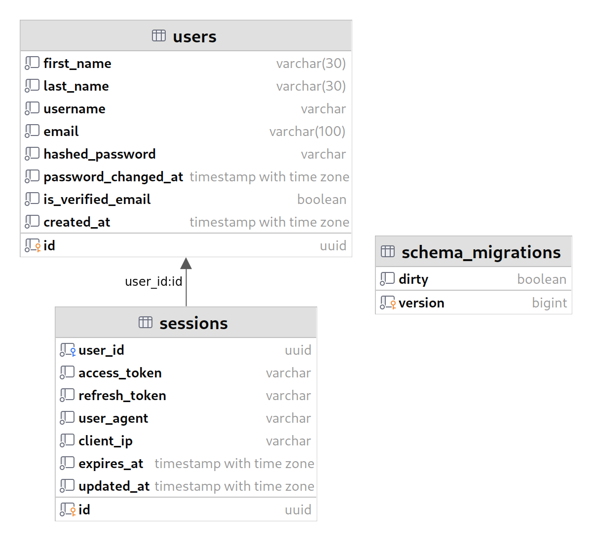
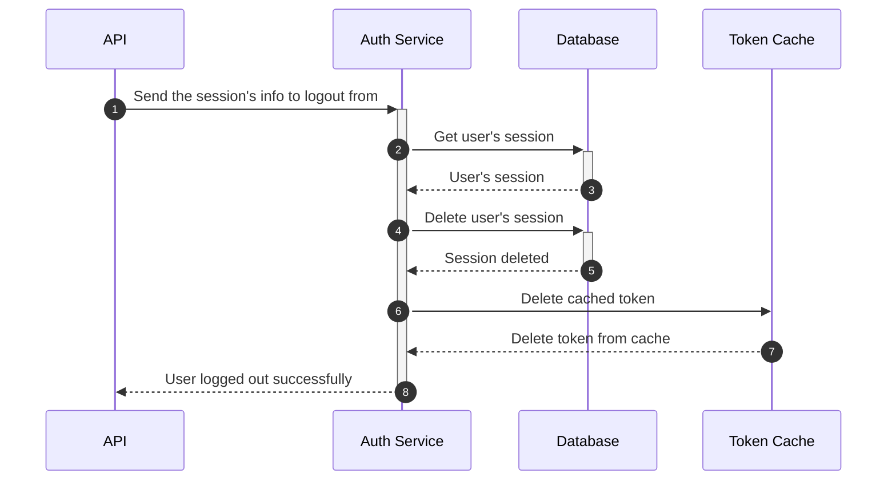
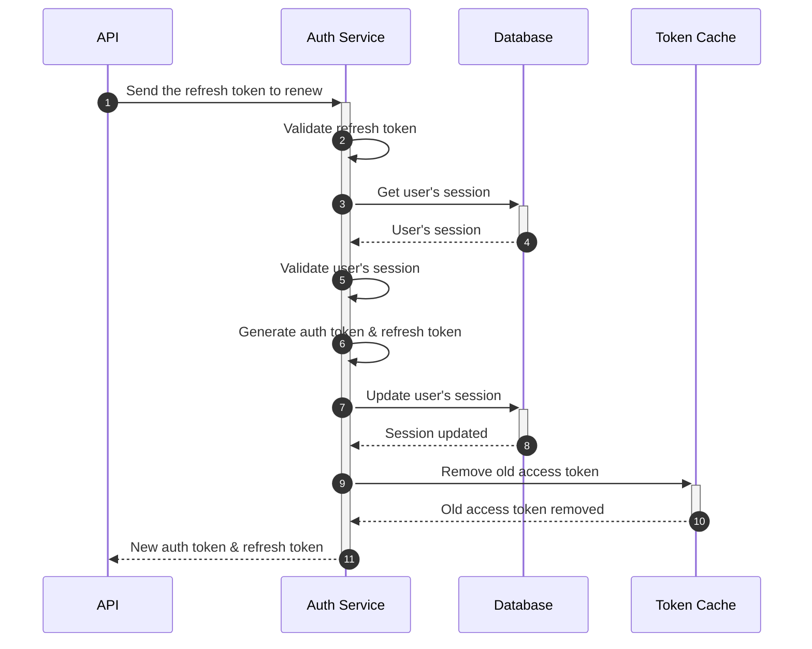
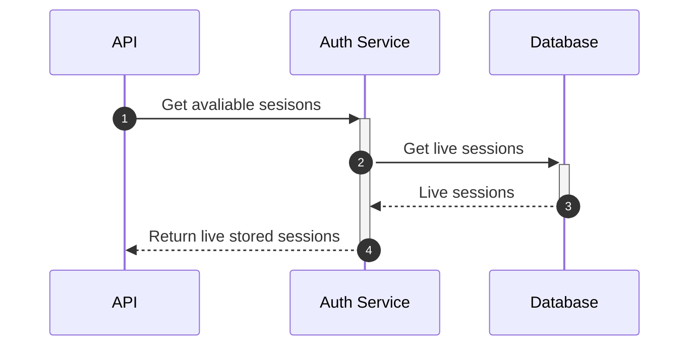

# Auth Service 🔑

This service is responsible for creating users & user’s session CRUD(authentication).

## Database 🗄

## Features 🚀

### Auth
- [x] SignUp
- [x] SignIn
- [x] Logout(For any session)
- [x] Renew auth token by refresh token
- [x] Get current open sessions

## Flow 🌊

* **Sign-up**
  - User creates a new account with email & password as login credentials.
  - Account confirmation(Email, Phone) is required to use the application.
  - User's info are passed along the request to the auth service.

* **Sign-in**
  - User signs in with email & password.
  - Generates a new auth token and refresh token for the user.
  - Create a new session for the user in the database.
  - Notifies the user about the new login session by sending an email.

* **Logout**
  - User id is taken from context
  - User signs out from the application.
  - Revokes the user's auth token.
  - Deletes the user's session from the database.

* **Renew Auth Token(Access, Refresh)**
  - User id is taken from context
  - Check the refresh token's lifetime has not expired.
  - Check the user's session in the database.
  - Check the user's session is not revoked, expired, or deleted.
  - Generate a new auth token and refresh token for the user.
  - Update the user's session in the database.
  - Return the new auth token and refresh token.

* **Get Current Sessions**
  - Return the current user sessions
  - User id is taken from context

