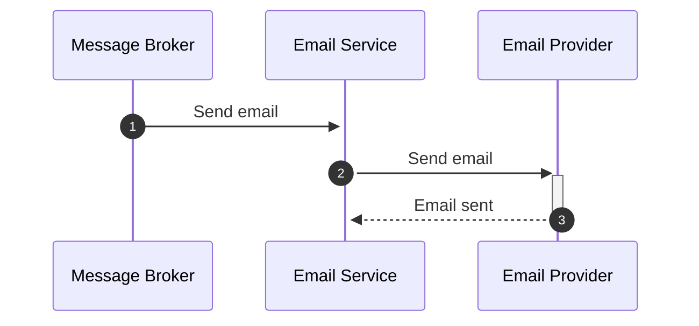

# Email Service 📧

This service is responsible for sending emails to users.

## Features 🚀

- Email user with confirmation code to verify account
- Email user with reset password code(reset password token)
- Email user with new login session details

## Flow 🌊

- Sending emails

Different emails are sent depending on the queue message received.

