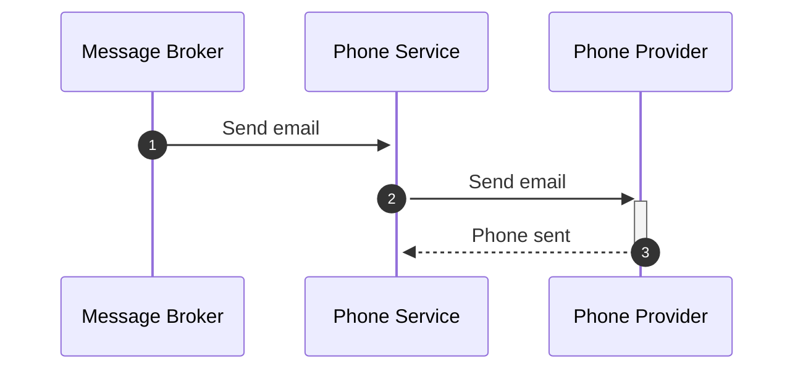

# Phone Service 📱

This service is responsible for sending SMS to users

## Features 🚀

- Send SMS with confirmation code to verify account
- Send SMS with payment confirmation code
- Send SMS on payment success to show new balance

## Flow 🌊

- Sending SMS

Different SMS are sent depending on the queue message received.

