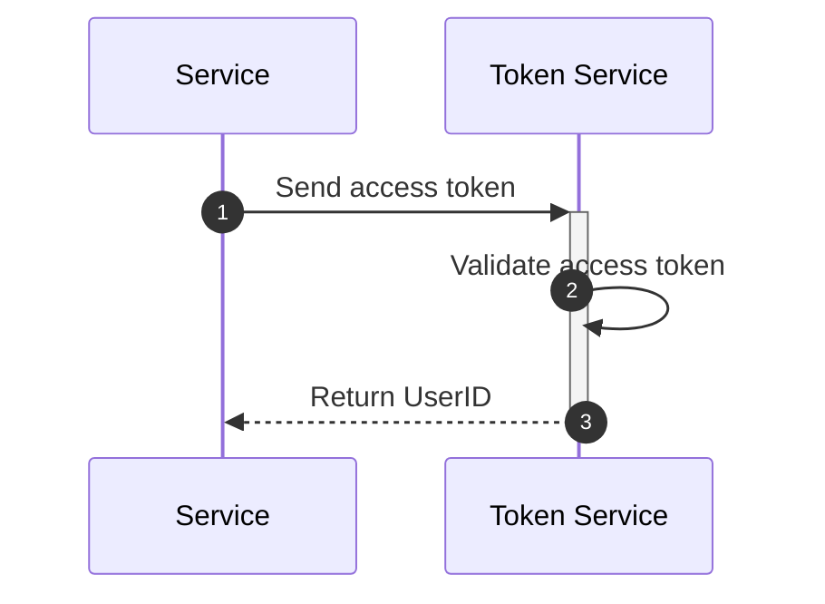

# Token Service 🎫

The service is responsible for ONLY validating the access token

## Features 🚀

### Token

- [x] Validate the access token

## Flow 🌊

* **Token Validation**
  - User sends the access token as grpc request to the token service.
  - Token service validates the access token.
  - Token validation takes in consideration the following:
    - Token is not expired
    - user's `client-ip` header matches the one stored in the token
    - user's `user-agent` header matches the one stored in the token

