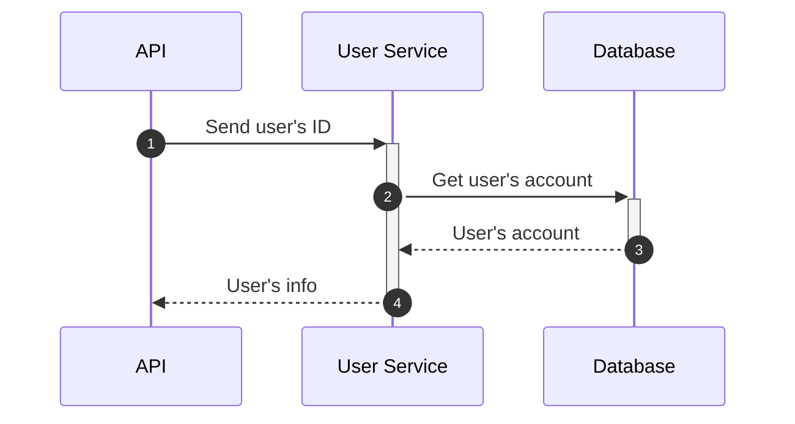
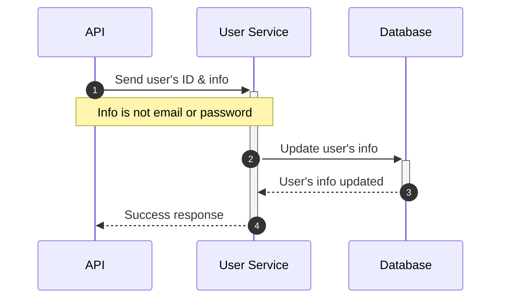
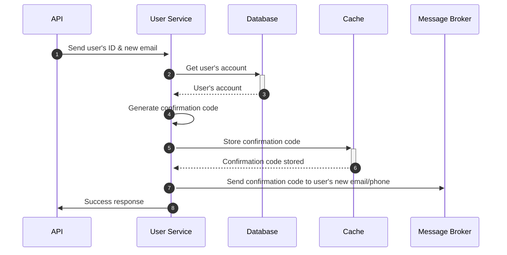
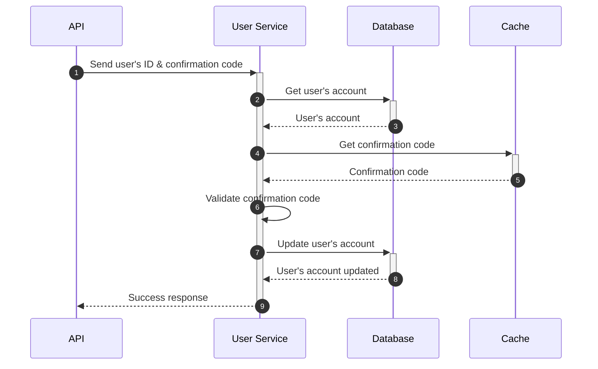
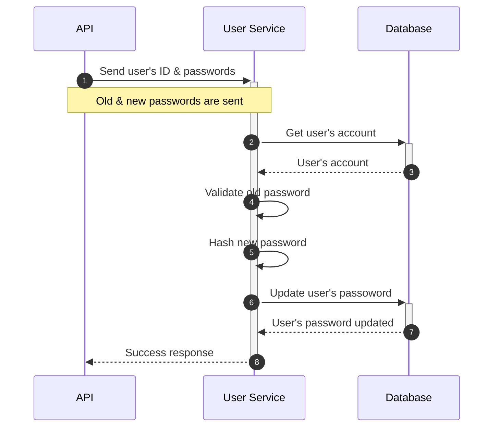
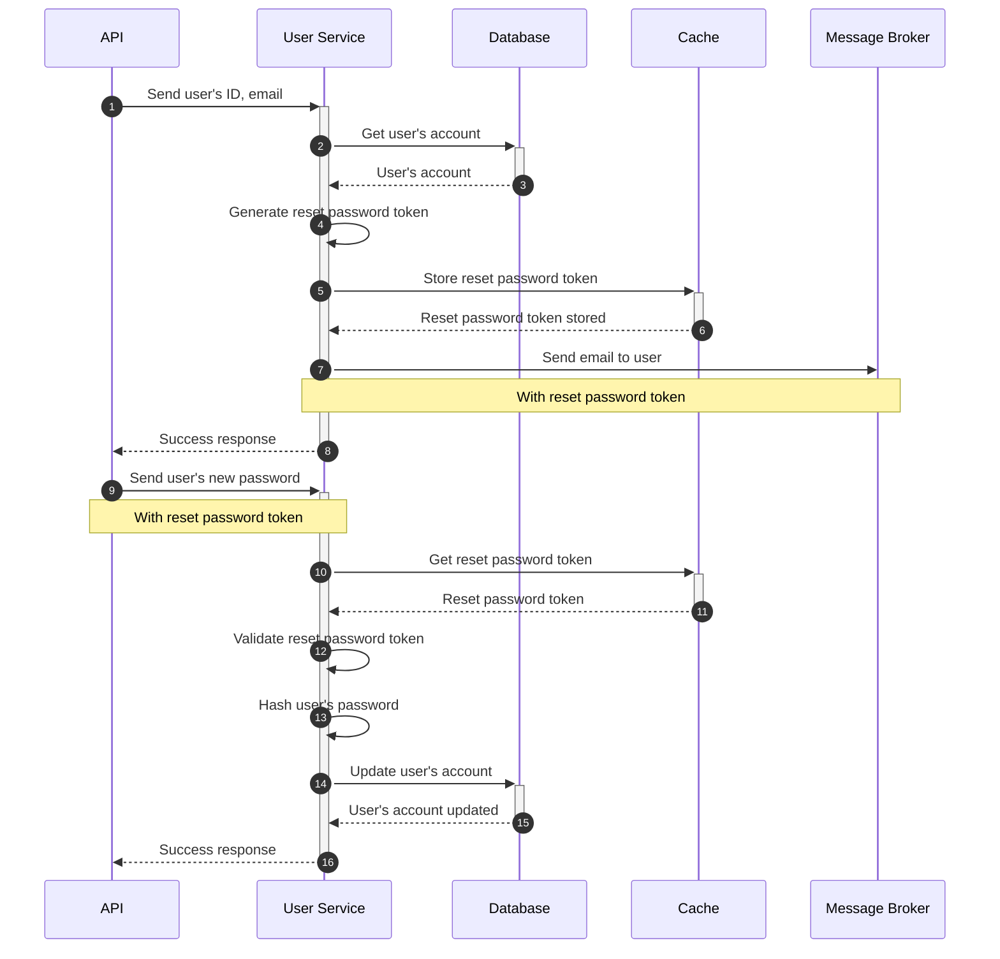

# User Service 👤

This service is responsible for storing and managing user’s information & updating all the user’s info

## Features 🚀

### User

- Get user information
- Update user’s email, password
- Restore forgotten password
- User’s Info
  - First name
  - Last name
  - Username
  - Email

## Flow 🌊

* **Get User Info**
  - User's info are retrieved from the database by the user's ID.
  - User's info are returned to the user after filtering the sensitive data.

* **Update User Info**
  - User's info are updated right away in the database after validating the user's password.
  - User's info are returned to the user after filtering the sensitive data.

* **Update User Email**
  - User's email is NOT updated right away.
  - User must confirm his new email first so that changes take place.

* **Verify User Email**

- User's email is updated after verifying the confirmation code.
- User's email is update in the database.

* **Update User Password**
  - User's password is updated right away in the database after validating the old password.
  - Password is hashed before storing it in the database.

* **Forgot Password**
  - User provides his email with which he signed up.
  - Email user's account with a reset password token.
  - User can reset his password with the reset password token and his new password.

