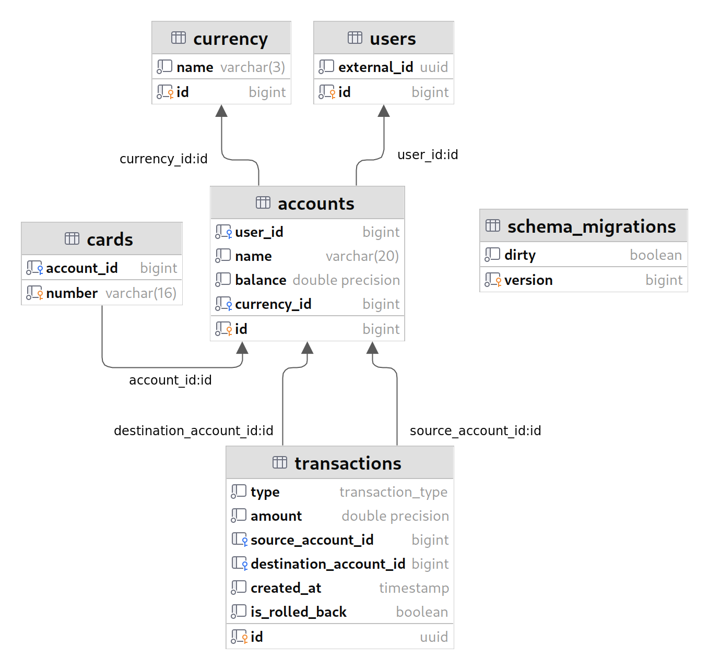
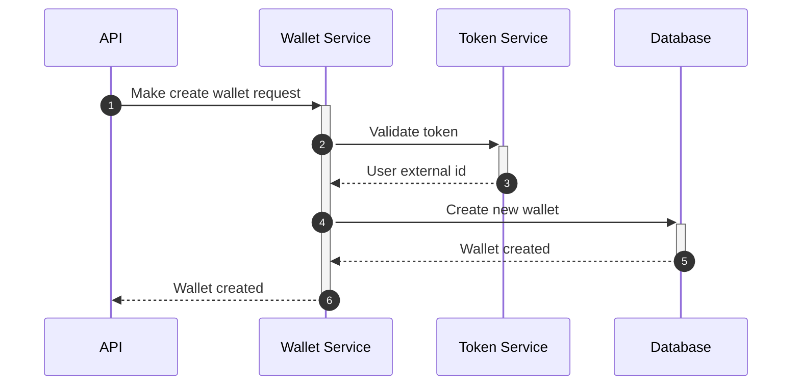
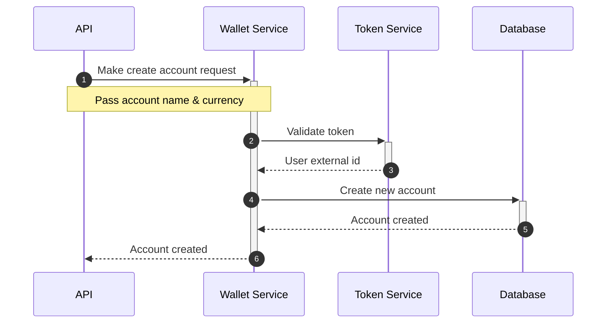
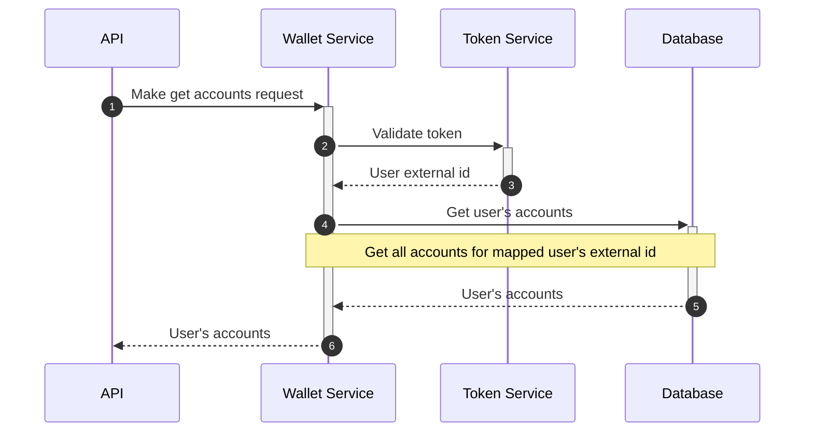
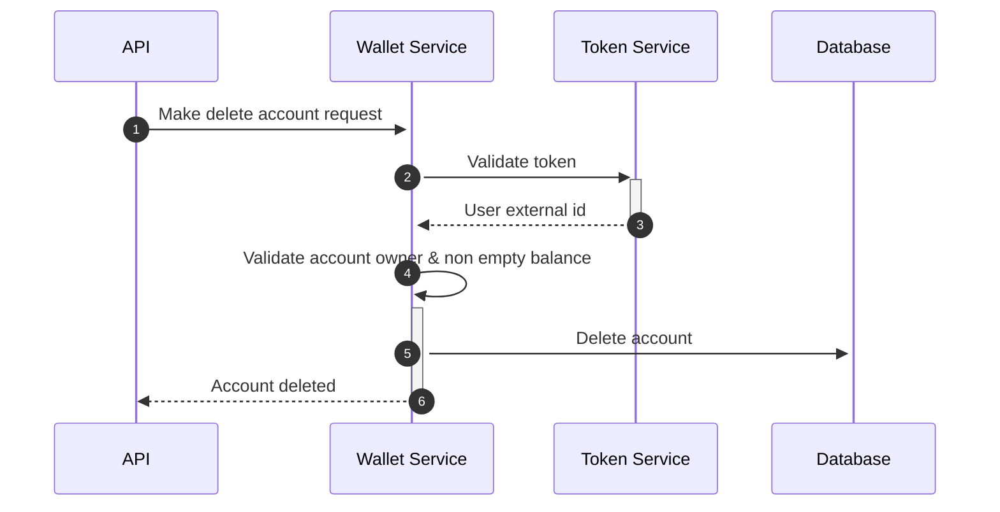
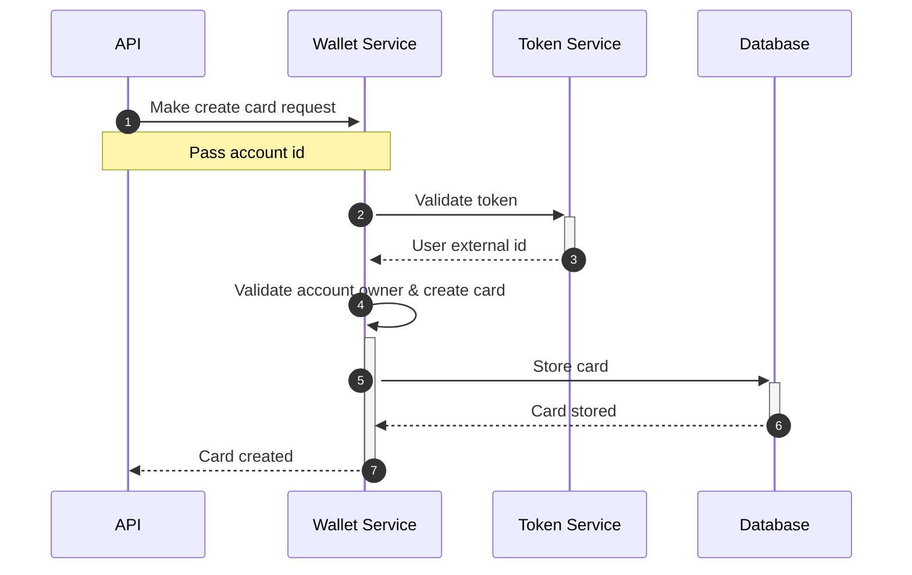
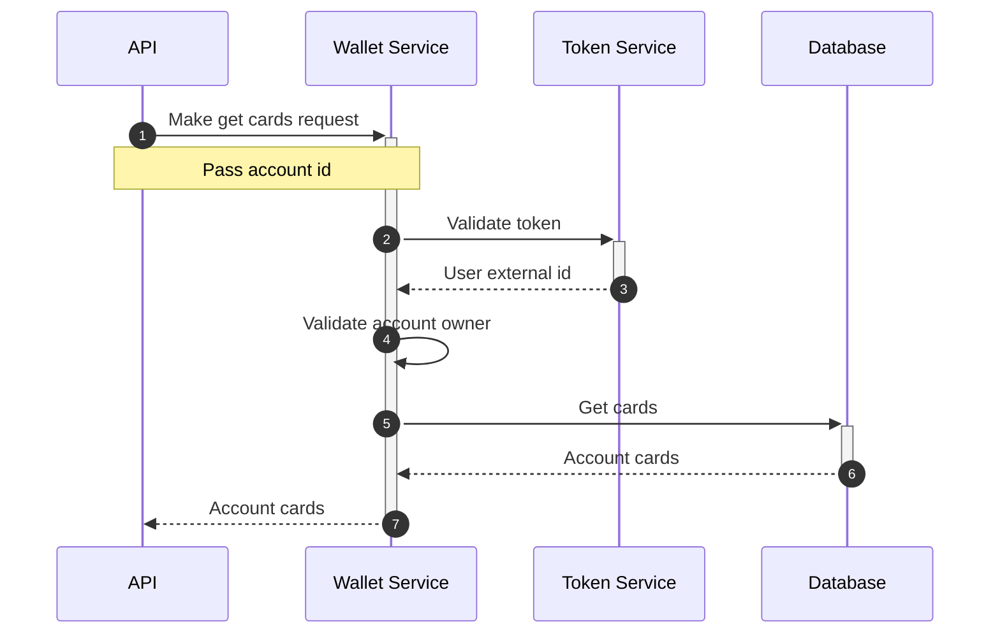
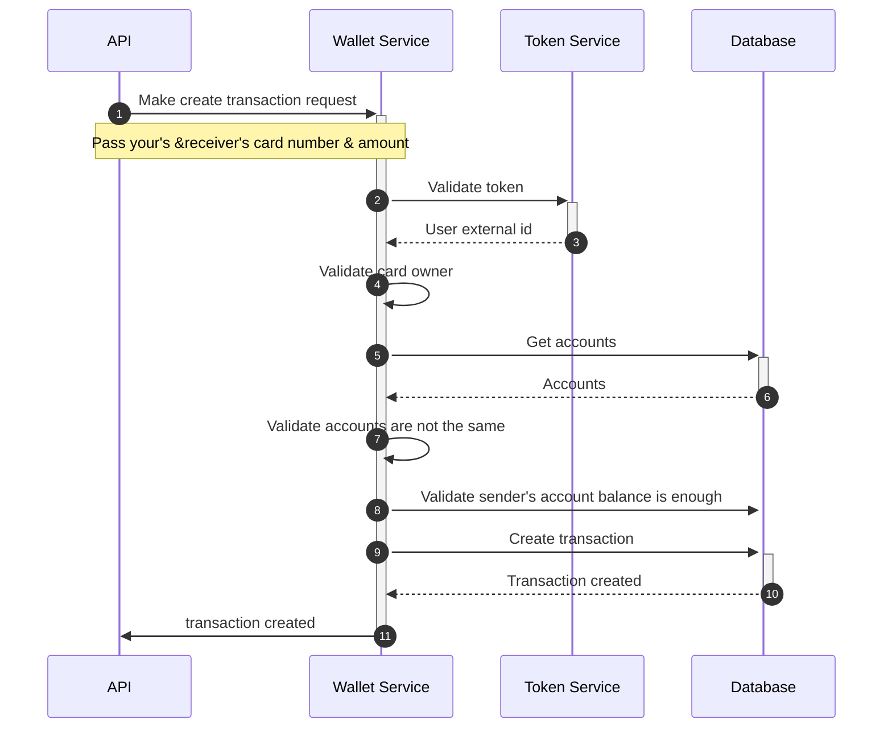
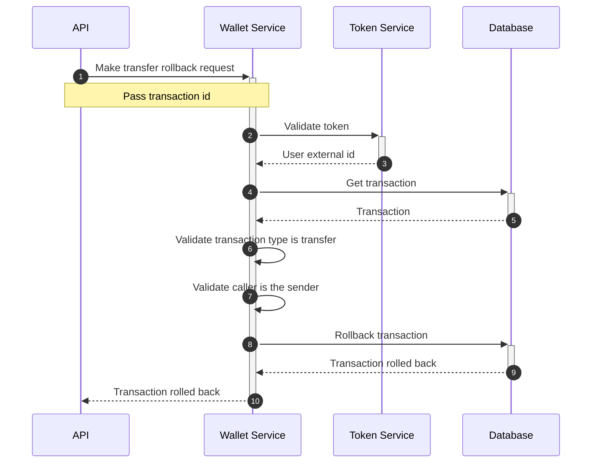
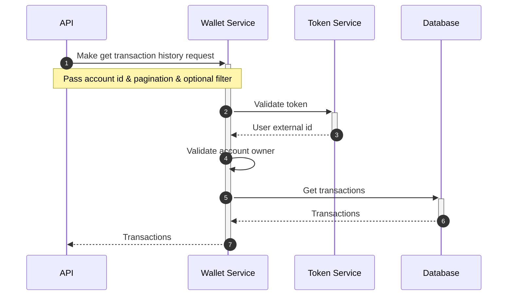

# Wallet Service 💰

The service is responsible for storing user’s accounts and manage balances changes.

## Database 🗄

## Features 🚀

### Account
 - [x] Create a user account with a specific currency & name.
 - [x] Get all user's accounts.

### Cards
 - [x] Create a new card for payment.
 - [x] Links a card to account.
 - [x] Get all cards for a specific account.

### Currency
 - [x] Support differecnt currencies(USD, RUB, EGP, GBP, EUR)

## Flow 🌊

* **CreateWallet**
  - Map external user's id to another internal user'id for the current database.

* **CreateAccount**
  - Create a new account for the user.
  - External user's id is mapped to internal user's id.
  - Internal user's id is used to create a new account.

* **GetAccounts**
  - Get all accounts for the user.
  - Doesn't support pagination.

* **DeleteAccount**
  -

* **CreateCard**
  -

* **GetCards**
  -

* **DeleteCard**
  -

* **CreateTransaction**
  - Transaction can be created with 3 different types:
    - **Transfer** - Transfer money from one account to another.
    - **Deposit** - Deposit money to an account.
    - **Withdraw** - Withdraw money from an account.
  - ONLY on transfer transaction  the receiver's account should be passed

* **TransferRollback**
  -

* **GetTransactionHistory**
  -

